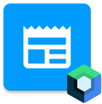
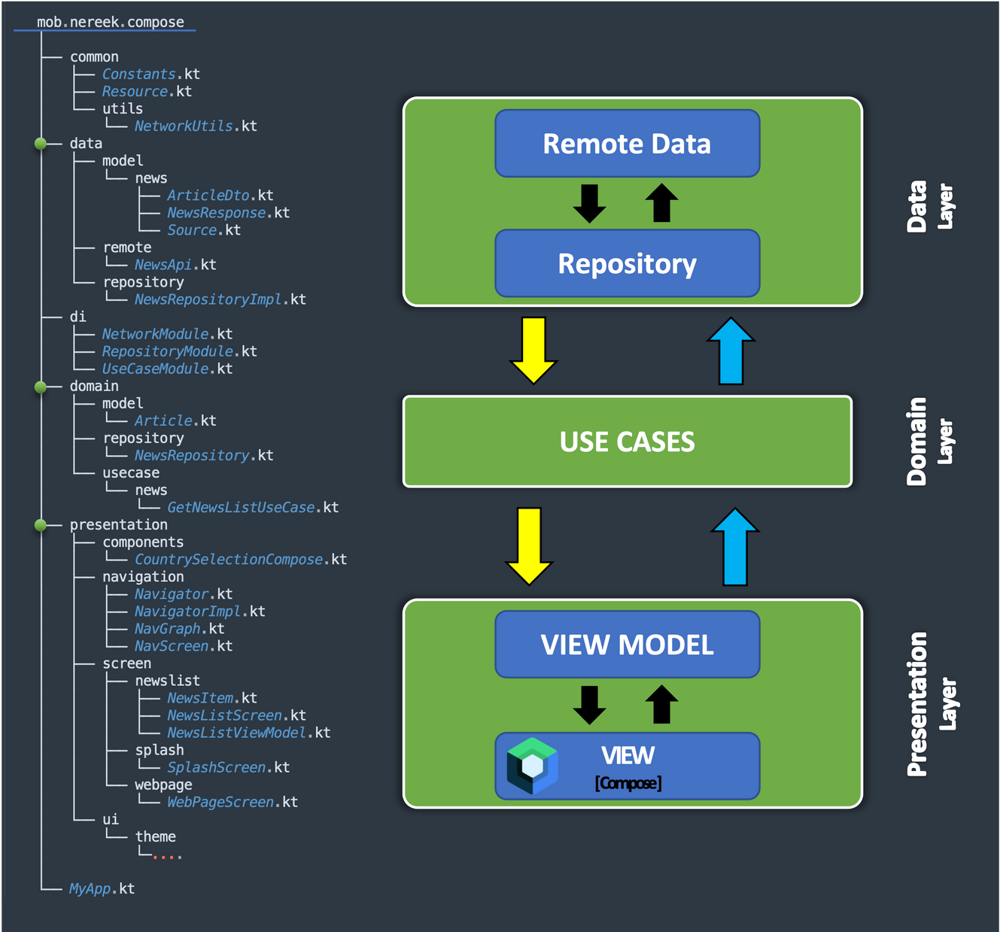
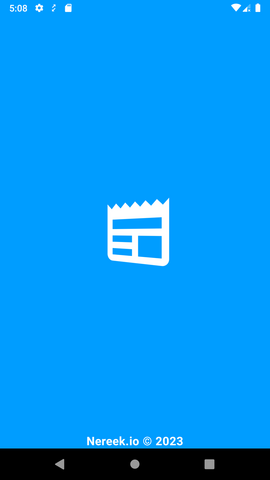
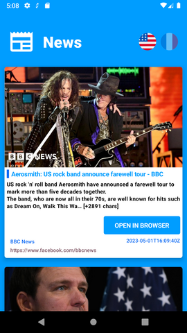
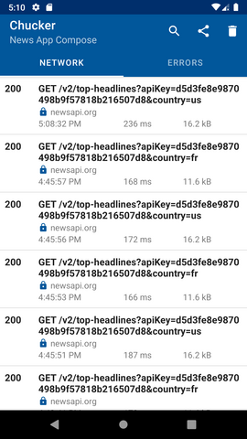

# News App Compose

**News App Compose** is a simple Android application that displays the latest news from the United States and France using the NewsAPI.org API. 

***This project serves as an introduction and demonstration of Clean Architecture and Jetpack Compose for building modern Android applications.***

## Architecture

The project adheres to the principles of clean architecture and is composed of several layers.

**The main layers of the project include:**

- **Presentation Layer:** This layer is responsible for managing the user interface of the application. It includes components such as views, controllers, and presenters.

- **Domain Layer:** This layer contains the business logic of the application. It defines the rules and operations that govern the behavior of the system. This layer should be independent of any specific technology or framework.

- **Data Layer:** This layer is responsible for managing the data sources used by the application. It includes components such as repositories, data mappers, and data access objects.

In addition, the project includes a **DI (Dependency Injection) layer** that provides dependency injection for the different layers of the application. This helps to keep the code modular and maintainable by allowing each layer to be developed and tested independently.

Finally, the project also includes a **Common layer** that contains shared classes and methods used by multiple layers of the application. This helps to reduce code duplication and improve consistency across the project.



The `mob.nereek.compose` follows a well-organized architecture to facilitate the development and maintenance of Android applications, with the aim of creating flexible and long-term maintainable software applications.

## Adding API token to the project

To add the API key, you need to replace `API_NEWS_TOKEN` with your actual News API key in the `Constants.kt` file.


```Kotlin
object Constants {
    ...
    const val API_NEWS_TOKEN = "\"your_api_key_here\""
    ...
}
```
You can get your API key by signing up for News API on their website: https://newsapi.org/register
## Libraries Used
Several third-party libraries were used to facilitate the development of the application. Here is a list of these libraries and the reasons why they were chosen:

- **Coroutines/Flow**: Asynchronous programming framework for performing non-blocking operations and managing data flows.
- **Dagger Hilt:** Dependency injection library that simplifies the process of managing and injecting dependencies.
- **Retrofit:** HTTP client for making network requests and handling responses in Android apps.
- **OkHttp:** Library for sending and receiving HTTP requests and responses, with support for interceptors and asynchronous calls.
- **Chuck Interceptor:** library to intercept and record HTTP traffic between an Android application and its network.
- **Moshi:** JSON parsing library for serializing and deserializing objects to and from JSON.
- **Coil:** Image loading library for Android with support for fetching and caching images from various sources.
- **Jetpack Compose:** Android UI toolkit for creating composable and declarative UIs.
- **Material3:** Material Design components built for Jetpack Compose, providing predefined UI elements.
- **Fastlane**: Automation tool for building, testing, and releasing Android applications.

**\# Libraries for unit testing and instrumentation testing are also included.**


**[** *These libraries are up-to-date as of the project's publication date* **]**


## Screenshots

<p align="center" float="left">







</p>

## Installation

To build and run the application, follow these steps:

1. Clone the repository.
2. Open the project in Android Studio.
3. Sync the project to download the required dependencies.
4. Build and run the application on an emulator or connected device.

## Usage

You can explore the different features and components of the application by navigating through the code and running the app. Additionally, you can use Fastlane for automation tasks such as testing and releasing the application. Mockk can be used for writing unit tests with mocked dependencies.

## Contributing

Contributions are welcome! If you have any suggestions, improvements, or bug fixes, feel free to open a pull request. Please follow the established coding style and conventions.

## 🛠 Skills
Kotlin, Android SDK, Clean Architecture, MVVM, Android Architecture Components, Retrofit, Dagger Hilt, Coroutines, Flow, OkHttp, Moshi, Coil, JetPack Compose, Material Design, Fastlane, Git, Junit, Mockk.

## License

[](https://choosealicense.com/licenses/mit/)

## Authors

- [Yassine Mourig](https://www.linkedin.com/in/yassine-mourig-computer-engineer/)

## Used By

This structure is used by the following companies:

- www.nereek.io (**YOFIFY LLC**)
